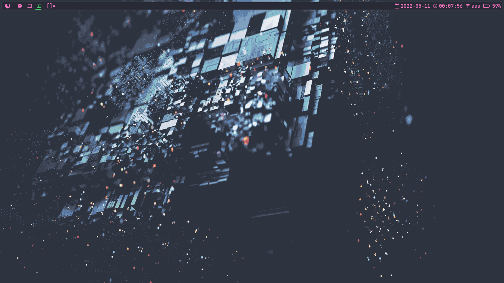
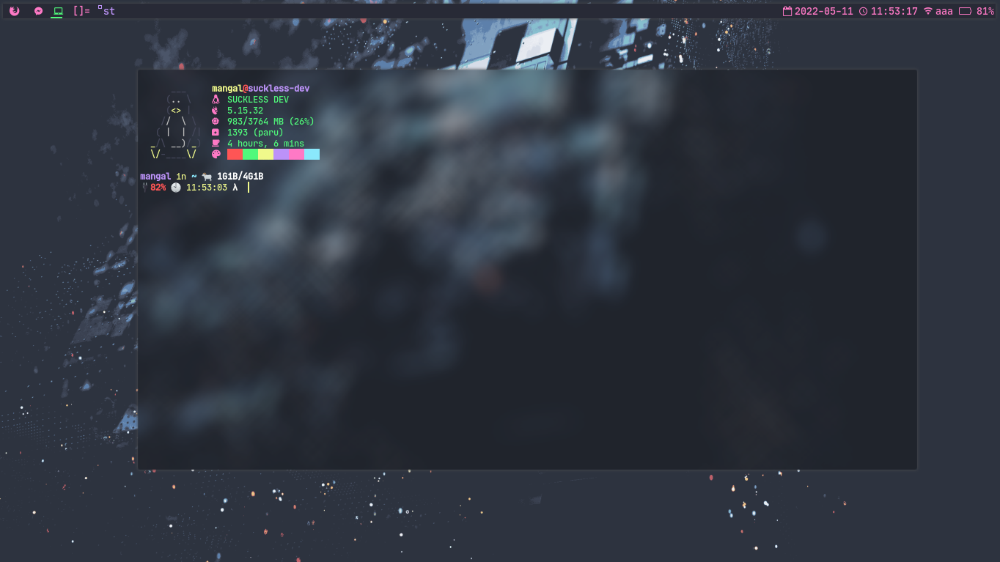
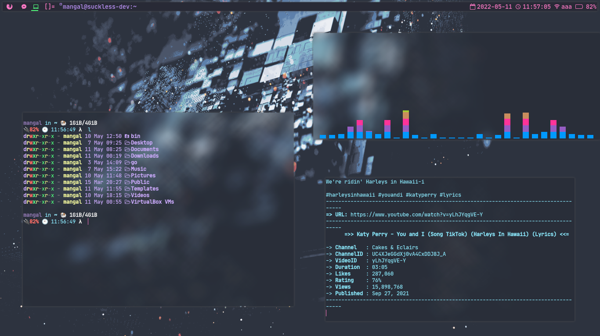
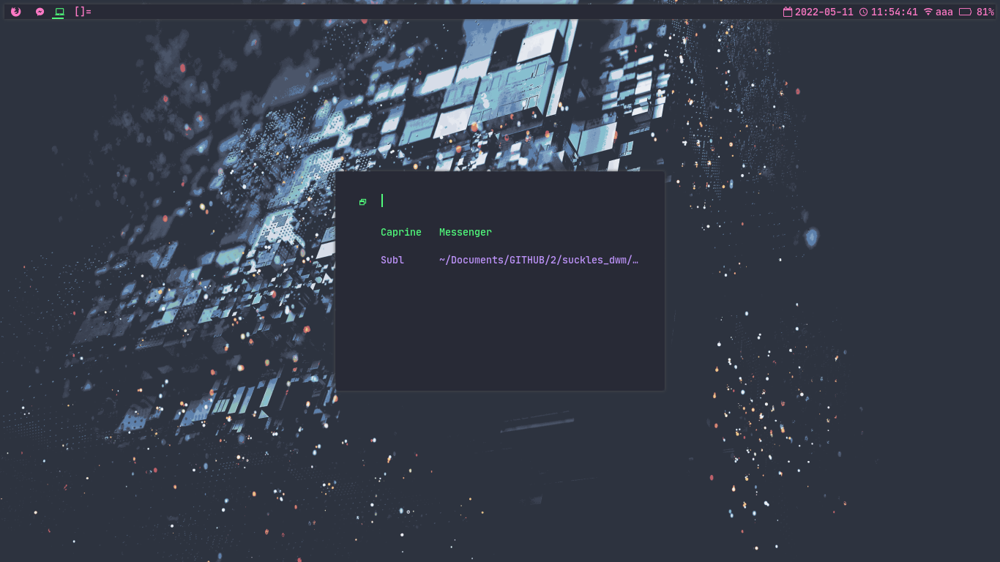
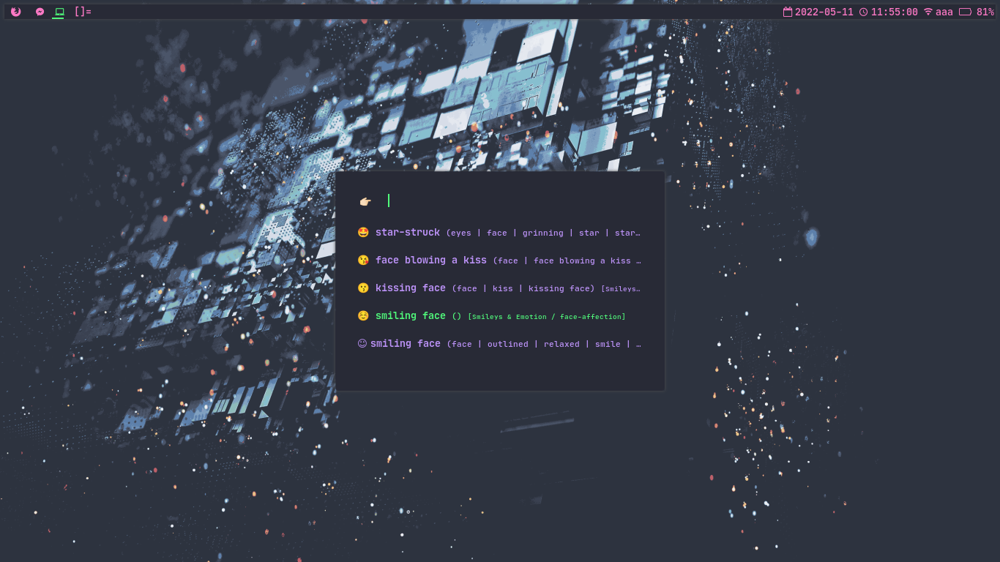
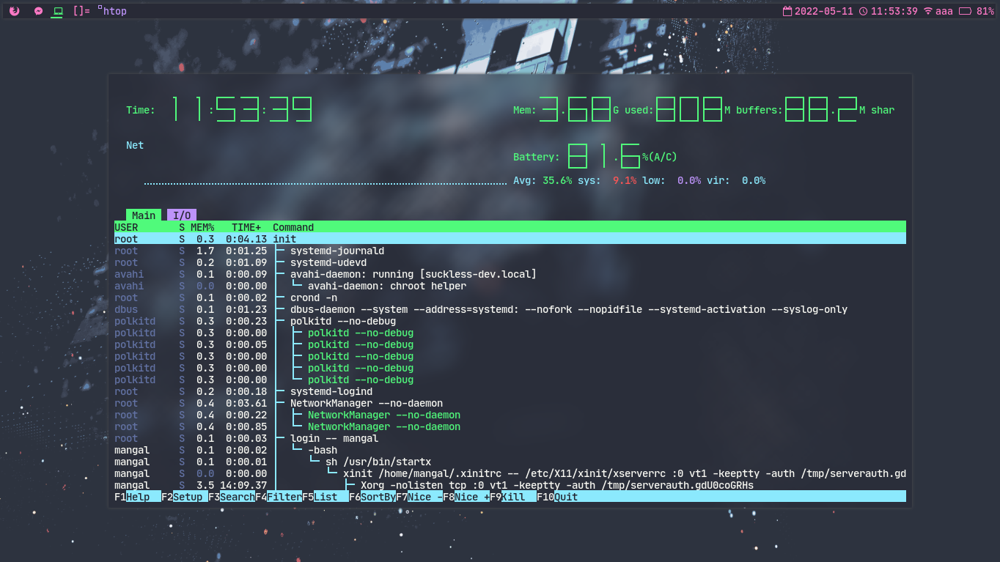
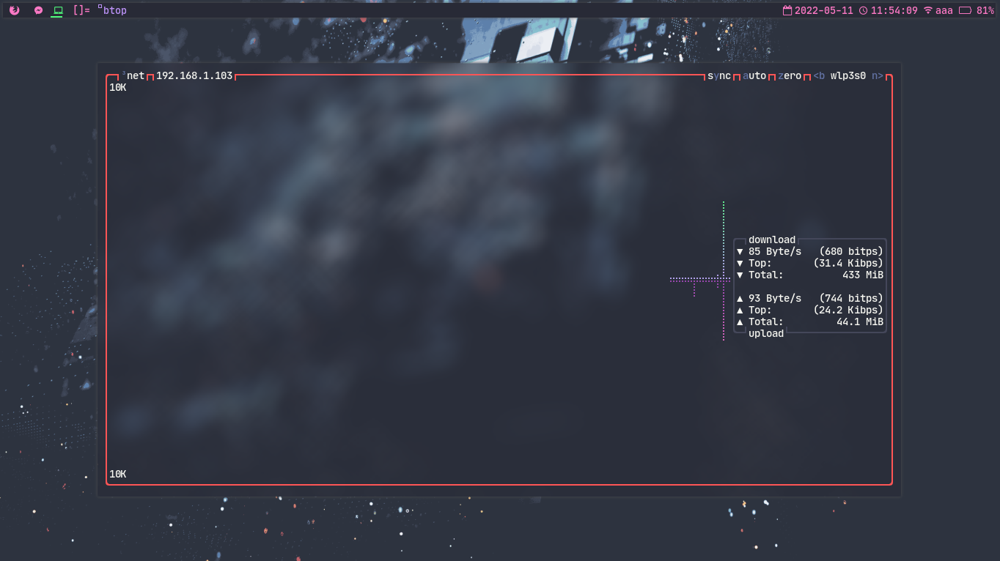
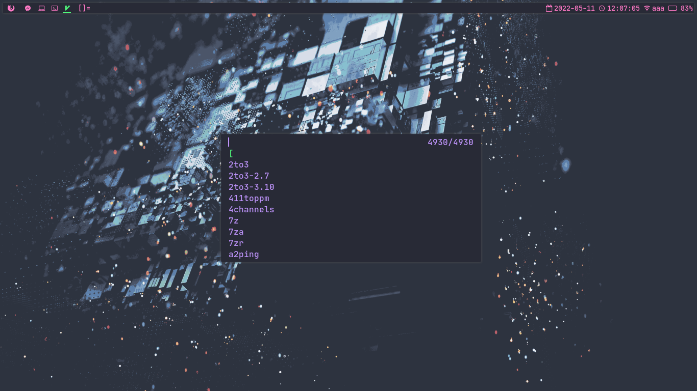

---

# MY DWM DOTFILES

Here is my less bloated DWM configured for the minimal workspaces . 
below i have given instruction to install my less bloadted DWM on your distro . 

I have not made any installation script because there might be some erros while using this , so you need to setup all the things and configuration manually , so that you will understand how these configuration works and where to place the configuration files and what to install and what are the dependencies and required as well as used software are named below which will make your work easier 

---

## REQUIREMENTS	
* dwm 👉🏻 Dynamic Window Manager 
* dmenu 👉🏻 application launcher 
* rofi 👉🏻 application launcher 
* pcmanfm 👉🏻 alternative GUI based file manager 
* ranger 👉🏻 CLI based file manager 
* termite 👉🏻 light weight terminal 
* kitty 👉🏻 yet another light weight fastest terminal 
* st 👉🏻 suckless's simple terminal 
* flameshot 👉🏻 screenshot utility 
* ncdu 👉🏻 ncurses disk usages analyzer 
* picom jonaburg fork 👉🏻 compositor for rounded corner and blur and transparent applications like terminal 
* feh 👉🏻 desktop background setting application 
* btop 👉🏻 system monitoring cli utility
* alsamixer 👉🏻 alsa audio mixer / volume controller
* xfce4-power-manager 👉🏻 light weight powermanager from xfce4 
* gnome polkit agent 👉🏻 gnome polkit agent for managing authentication
* dunst 👉🏻 light weight notification daemon 
* pavucontrol 👉🏻 pulse audio volume control 
* betterlockscreen 👉🏻 light weight screen locker
 

You need to install all the required dependencies & becareful on the version , just install the latest version . you can exclude some of them as well like if you like CLI then you can install ranger as a default file manager , its not necessary to install pcmanfm and you are not compulsory to use software that i have use like you can replace flameshot with xfce4-screenshooter . Just keep in mind that you need to install those softwares .

---

## Dependencies Installation 

When installing dependencies you may not get all the tools on your official repo based upon your distro , you may have to build it from source , then dont worry just do it . 😥 if you are using arch based distro then you will get it on arch user repository shorts for AUR using AUR helper , yay && paru . 

Installation of all the dependencies are easy , just do it yourself . 
just you need to install picom from this fork , so i have given link below , install it from there & a detailed instruction is given there in the documentation : 
`https://github.com/jonaburg/picom`

---

## Installation 

* `cd $HOME && git clone https://github.com/TheLinuxGuy001/suckles_dwm.git  && cd suckless_dwm;ls` 👉🏻 clone to the home dir
* `cp -rv fonts ~/.fonts` 👉🏻  Copy fonts directory to .fonts in home directory
* `cp -rv .config/* ~/.config/` 👉🏻 Copy contents of .config directory to .config in home directory 
* `cp -rv bin ~/` 👉🏻 copy bin directory to home directory 
* `cp autostart/* ~/.autostart/ && chmod u+x ~/.autostart/autostart.sh` 👉🏻 copy autostart to .autostart in home directory
* `cp .xinitrc ~/ && chmod u+x ~/.xinitrc` 👉🏻 copy .xinitrc to home directory 
* `cp .bashrc ~/ ` 👉🏻 copy .bashrc to home directory [ bash resource file ]

### Finally lets install the DWM && st && dmenu && slstatus
One by One Go to dmenu && st && slstatus && dwm directory and run the following command to install these 
* make && sudo make clean install

### Install these dependencies if you face any error while compiling DWM && remember package name might be different based upon your distro but dont worry search the package name using your package manger and install it 🥰

* gcc 
* make
* libx11-6
* libx11
* libx11-dev
* libxft2 libxft-dev
* libxinerama-dev
* libxinerama1

Remember you have to do this with dmenu && st && slstatus && dwm 
if you got any error while compiling and installing it check for the library and still not solved then leave your issue on issue section 

### Configuring DWM for Lightdm or Any Display Manager 
 * `sudo cp -v dwm.desktop /usr/share/xsessions/dwm.desktop` 👉 desktop file for dwm
 * `sudo cp mydwm /usr/local/bin/ && sudo chmod +x /usr/local/bin/mydwm` 👉 script to launch dwm

---

## Further Installation 
* Wanna Customize Ranger like mine ? 
Go through with this video i have given detailed instruction here : 
👉 https://www.youtube.com/watch?v=uGV9Fdi2ADo

Learn how to customize DWM ? 
* DWM Showcase Video : 
👉 https://www.youtube.com/watch?v=uUOQDAlk894&t=37s

* DWM Installation Video : 
👉 https://www.youtube.com/watch?v=3fcaikKJF9I&t=122s

* DWM Customization Video : 
👉 https://www.youtube.com/watch?v=FBk1k1ppXQk

* Wanna Learn how to customize rofi : 

👉 https://www.youtube.com/watch?v=fFCVALIDk5k&t=28s

---

## SOME SCREENSHOTS 
### Cool Desktop with colorful Bar and simple patched DWM 

### Patched ST

### Floating Layout Rules 

### Rofi Application Launcher 

### Rofi Window Switcher

#### NOTE IF you want ot use window switcher then you need apply this patch on your dwm .. 
👉 `https://dwm.suckless.org/patches/ewmhtags/`

### Rofi emoji Launcher 

### htop

### btop

### Dmenu

